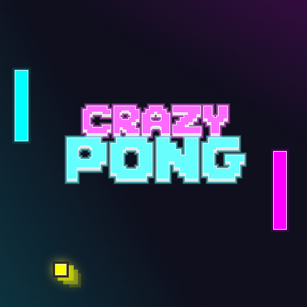

# Crazy Pong: Neon Dash

<table width="100%">
  <tr>
    <td width="80%" align="left">
      <p><b>A Pong variant</b></p>
      <p><i>Built with a Custom C++ Engine & Lua Scripting</i></p>
    </td>
    <td width="20%" align="right">
      
    </td>
  </tr>
</table>

---

## 📸 Showcase

<p align="center">
  
  <br />
</p>

---

## 🕹️ The Twist
**Crazy Pong** makes it flashy and way more difficult then the normal pong:
* **Dash Mechanics:** Precision movement to intercept high-speed shots.
* **Power-Ups:** Game-changing abilities that shift the tide of the match.
* **Neon Visuals:** Retro-inspired aesthetics with modern particle effects.

---

## 🛠️ Technical Implementation
This project was developed for a Software Engineering course, focusing on the interface between low-level engine architecture and high-level gameplay scripting.

* **Custom C++ Engine:** Game Engine provided by DAE.
* **Lua-C++ Bindings:** I wrote the bridge between the engine and the script, allowing the C++ core to execute high-level Lua logic.
* **Gameplay Scripting:** 100% of the game logic—including player movement, level triggers, and the "deletion" mechanic—was written by me in Lua.

---

## 🎨 Art & Assets
I served as the sole technical artist for this project, creating:
* Original 2D icons.
* Visual effects (VFX) for mechanical interactions like the the shake.

---

## 🚀 How to Run
> **Note:** This project was built for Windows/OpenGL. (Drag game_Pong.lua on the .exe to run)

   ```bash
   Game/LuaGameEngine.exe


